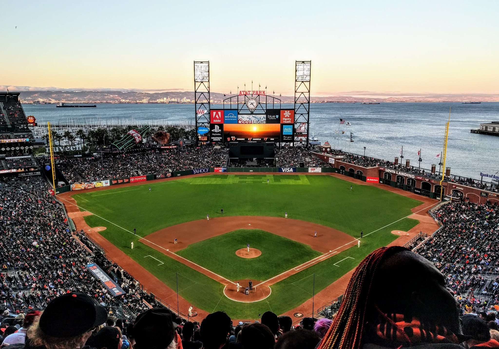

# PYVizHomework

## Background

The idea was to help Harold build a "prototype dashboard" for his company who has started a Real Estate Investment division. Regardless on your ethical feelings on contributing to the real estate bubble this can be a good exercise on doing work you may not entirely agree with! 

## Process 
Jokes aside first thing you do is import all of the PyViz data you need and make sure that you have your map_box info in your .env . Then you load the data. I ran the general .head() bit to make sure that the data looked all right and proper. Making sure to index it by the year. 

Cleaned up the data, indexed it properly, spend some fun time fiddling around with the ylimits in line 25 to figure out what looked best before I settled on 360000-385000
Experimented with the colors on the lines, making them the colors for the San Francisco Giants. All together putting this together was basic work on making sure I used the right data, typed everything right, used the right plot, and made sure my Mapbox API was working. It came out looking pretty good and should help "Harold" with his idea. 

## Dashboard
The dashboard was pretty straightforward. Just doing the def/return although I was paranoid enough to make sure that the code worked fine before putting in the def/return. One thing I do feel I need to look up later is to make a dashboard fancier. 
